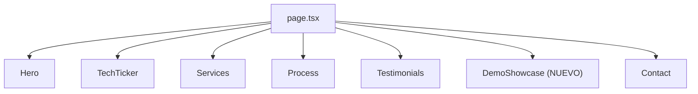
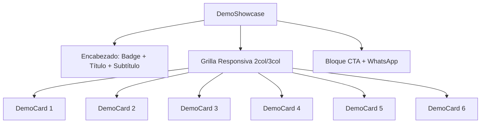

# Documento de Diseño — Sección Demo Showcase

## Visión General

Este documento describe el diseño técnico para la sección Demo Showcase de la landing page de DevHorses. La sección se integra entre Testimonials y Contact, mostrando 6 tarjetas de demos interactivas con animaciones Framer Motion, soporte i18n (es/en), y un bloque CTA con botón de WhatsApp.

El componente sigue los patrones existentes del proyecto: `"use client"`, datos tipados dentro del componente usando `t()`, animaciones `whileInView` con stagger, y el lenguaje visual de `GlowCard` (fondo oscuro `#0B1121`, bordes `slate-800`, glow en hover).

## Arquitectura

### Integración en la Landing Page



La sección se inserta en `page.tsx` entre `<Testimonials />` y `<Contact />`, siguiendo el mismo patrón de importación directa que usan los demás componentes.

### Estructura del Componente



## Componentes e Interfaces

### Archivo: `src/components/DemoShowcase.tsx`

Componente cliente único que contiene toda la lógica. No se crean subcomponentes en archivos separados — se sigue el patrón de `ProjectsSection.tsx` donde el componente auxiliar (`ProjectCard`) es una función interna en el mismo archivo.

### Interfaz DemoData

```typescript
interface DemoData {
  id: number;
  nameKey: keyof Translations;
  categoryKey: keyof Translations;
  descriptionKey: keyof Translations;
  demoUrl: string;
  gradient: string;
}
```

Decisión de diseño: Se usan claves de traducción (`nameKey`, `categoryKey`, `descriptionKey`) en lugar de strings directos, siguiendo el patrón de `Testimonials.tsx` donde los datos referencian claves del `LanguageContext`. Esto permite que `t()` resuelva el texto correcto según el idioma activo.

### Componente DemoShowcase (exportado por defecto)

Responsabilidades:
- Renderizar el encabezado de sección (badge, título, subtítulo) con animación fade-up
- Definir el array `demosData: DemoData[]` dentro del componente
- Renderizar la grilla CSS responsiva con las 6 tarjetas
- Renderizar el bloque CTA final

### Función interna DemoCard

```typescript
function DemoCard({ demo, index }: { demo: DemoData; index: number })
```

Responsabilidades:
- Renderizar nombre, categoría (badge), descripción
- Botón "Ver demo" → `window.open(demoUrl, '_blank')` con `rel="noopener noreferrer"`
- Botón "Quiero algo así" → abre WhatsApp con mensaje pre-llenado referenciando el nombre de la demo
- Efecto hover: elevación (box-shadow), escala (`scale(1.02)`), transición suave (~300ms)
- Animación de entrada: `motion.div` con `whileInView`, stagger via `delay: index * 0.1`

### Integración con LanguageContext

Se agregan nuevas claves al tipo `Translations` y a los objetos `es`/`en` en `src/context/LanguageContext.tsx`:

```
// Demo Showcase
demo_badge, demo_title, demo_subtitle
demo_1_name, demo_1_category, demo_1_desc
demo_2_name, demo_2_category, demo_2_desc
demo_3_name, demo_3_category, demo_3_desc
demo_4_name, demo_4_category, demo_4_desc
demo_5_name, demo_5_category, demo_5_desc
demo_6_name, demo_6_category, demo_6_desc
demo_btn_view, demo_btn_want
demo_cta_title, demo_cta_btn
```

## Modelos de Datos

### Array de Demos (6 elementos)

| # | URL | Nombre (es) | Categoría (es) |
|---|-----|-------------|-----------------|
| 1 | `https://demo-gimnasio-eight.vercel.app/` | Gimnasio FitPro | Fitness |
| 2 | `https://demo-restaurante-pasteleria.vercel.app/` | Pastelería Dulce Arte | Gastronomía |
| 3 | `https://demo-restaurante-carnes.vercel.app/` | Parrilla & Brasas | Gastronomía |
| 4 | `https://mv-abogados.vercel.app/` | MV Abogados | Servicios Profesionales |
| 5 | `https://apu-garden-lodge.vercel.app/` | Apu Garden Lodge | Hospedaje |
| 6 | `https://demo-retail.vercel.app/` | Tienda RetailPro | E-commerce |

Cada demo incluye un `gradient` string (ej: `"from-cyan-500 to-blue-500"`) para el acento visual de la tarjeta, siguiendo el patrón de `ProjectsSection`.

### URL de WhatsApp

Se construye dinámicamente:
```
https://wa.me/51999999999?text={mensaje_codificado}
```

- Para botón "Quiero algo así": mensaje incluye el nombre de la demo
- Para botón CTA general: mensaje genérico de consulta

Se usa el mismo número de teléfono que `WhatsAppButton.tsx` (`51999999999`).

## Manejo de Errores

Este componente es puramente presentacional y no realiza llamadas a APIs ni maneja estado complejo. Los posibles errores son mínimos:

- **URLs de demo rotas**: Se abren en nueva pestaña (`target="_blank"`), el navegador maneja el error. No se requiere manejo especial.
- **WhatsApp no instalado**: El enlace `wa.me` redirige a WhatsApp Web automáticamente. No se requiere fallback.
- **Claves de traducción faltantes**: TypeScript garantiza en tiempo de compilación que todas las claves existan en `Translations`, ya que se usa `keyof Translations`.

## Estrategia de Testing

### Evaluación de Property-Based Testing

PBT **no aplica** para esta funcionalidad porque:
- Es un componente de UI puramente presentacional (renderizado de tarjetas, animaciones, hover effects)
- No contiene lógica de negocio, transformaciones de datos, ni algoritmos
- No hay funciones puras con input/output variable que se beneficien de 100+ iteraciones
- Los datos son estáticos (6 demos hardcodeadas)

### Enfoque de Testing Recomendado

**Tests unitarios (example-based):**
- Verificar que se renderizan exactamente 6 tarjetas de demo
- Verificar que cada tarjeta muestra nombre, categoría y descripción
- Verificar que los botones "Ver demo" tienen los `href` correctos con `target="_blank"`
- Verificar que los botones "Quiero algo así" generan URLs de WhatsApp válidas con el nombre de la demo
- Verificar que el bloque CTA se renderiza con el botón de WhatsApp
- Verificar que el cambio de idioma actualiza todos los textos visibles

**Tests de snapshot:**
- Snapshot del componente completo en español
- Snapshot del componente completo en inglés

**Tests manuales:**
- Verificar layout responsivo (2 columnas mobile, 3 columnas desktop)
- Verificar efectos de hover (elevación, escala, transición suave)
- Verificar animaciones de entrada con stagger al hacer scroll
- Verificar que las URLs de demo abren correctamente en nueva pestaña
- Verificar integración visual con secciones adyacentes (Testimonials y Contact)
